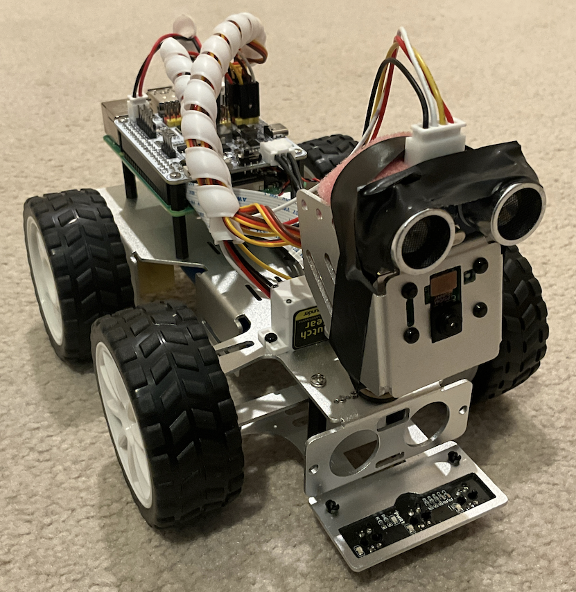

# AI, Robotic, and IoT Project

**KITT** – An Intelligent, Autonomous, and Conversational Robot Car (Inspired by Knight Rider)

> *“One person can make a difference.” – Knight Rider*

Welcome to **AI, Robotic, and IoT** project, a cutting-edge project at the intersection of **Artificial Intelligence**, **Robotics**, and the **Internet of Things**. This repository brings together multiple domains of advanced computing to build **KITT**, a smart, self-driving robot car capable of voice interaction, autonomous navigation, and IoT-based control.

## Demo

Check out the demo of KITT in action:  
[Watch the Video on YouTube](https://youtu.be/btqBe0lDBhk)

## Vision

This project is a glimpse into the **future of intelligent transportation and smart living**, where machines not only think and act but also **listen, understand, and respond**. By combining Robotics, AI, and IoT, KITT demonstrates a truly interdisciplinary system that pushes the boundaries of what’s possible.

## Modules

### IoT – Remote IoT Home Automation and Control
- Control and monitor smart home devices through KITT
- Cloud or edge-based communication interface
- MQTT or HTTP protocol support

### RL – Reinforcement Learning for Autonomous Driving
- RL algorithms to learn and optimize self-driving behaviors
- Simulated and real-world training environments
- Obstacle avoidance, path planning, and adaptive learning

### NLP – Voice-Based Command and Interaction
- Speech-to-text and text-to-speech pipeline
- Command parsing using NLP techniques
- Enables natural, hands-free interaction with KITT

### CV – Computer Vision for Perception
- Object detection, lane following, and environment mapping
- Essential for real-time feedback in reinforcement learning
- Enhances safety and decision-making in driving tasks

## Documentation

Explore more in-depth documentation in the following sections:

- [Motivation](docs/01_Motivation.md)
- **Technical Approach** 
    - [IoT](docs/02_Technical_Approach_IoT.md)
    - [RL](docs/03_Technical_Approach_RL.md)
    - [NLP](docs/04_Technical_Approach_NLP.md)
    - [CV](docs/05_Technical_Approach_CV.md)
- **Implementation Details** 
    - [IoT](docs/06_Implementation_Details_IoT.md)
    - [RL](docs/07_Implementation_Details_RL.md)
    - [NLP](docs/08_Implementation_Details_NLP.md)
    - [CV](docs/09_Implementation_Details_CV.md)
- [Results](docs/10_Results.md)  
- [Overall Project Discussion](docs/11_Overall_Project_Discussion.md)

> These markdown files can be found in the `docs/` directory of the repository.

## Code

All project code is organized in the `code/` directory:

- `IoT/` – Code, scripts, images and configurations for remote IoT device control and integration
- `RL/` – Reinforcement Learning models, training environments, and driving policies
- `NLP-CV/` – Combined Natural Language Processing and Computer Vision modules for voice interaction and visual perception

See the [code/README.md](code/README.md) for details on structure, usage, and module-specific instructions.

> *Note: This repository is under active development. We will continue to add code and documentation as it becomes available.*

## Contributing

We welcome contributions! Whether it's improving existing modules or adding new ones, feel free to fork the repo and create a pull request.

## Contact

Have questions or suggestions? Feel free to open an issue or contact the maintainer.