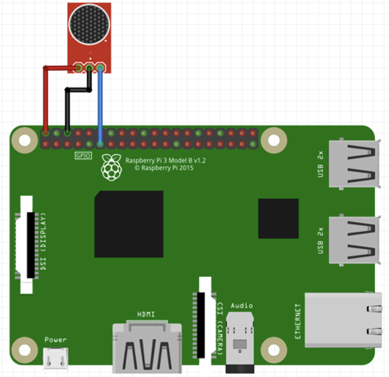
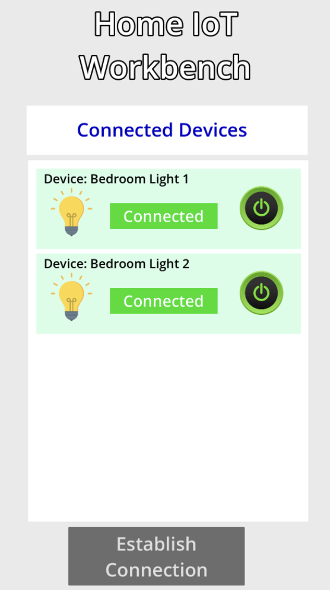

# IMPLEMENTATION DETAILS: IOT - REMOTE HOME AUTOMATION AND CONTROL

## IMPLEMENTATION DETAILS

Our remote home automation system was implemented by integrating three core subsystems—smart plugs, sound-based detection, and a remote/mobile control interface—each leveraging different hardware components and custom software logic. The entire system was built around the MQTT protocol, chosen for its lightweight, publish-subscribe communication model ideal for real-time IoT interactions.

## SMART PLUGS:

We used two Theengs Plugs, which we configured by connecting each plug individually to a home Wi-Fi network and specifying the MQTT broker details hosted on the Raspberry Pi. Each plug was associated with a bedroom lamp, allowing remote power toggling and energy monitoring via MQTT topics.

## CLAP DETECTION:

The Raspberry Pi subsystem consisted of a KY-037 sound sensor, wired directly into GPIO pin 17, along with ground and 5V power connections. A Python script was developed to detect and differentiate between single and double claps using interrupts and timers. Specifically, the script monitored falling-edge signals on the designated GPIO pin, indicating sudden audio peaks from claps. Upon detecting the first clap, the script initiated a one-second timer. If a second clap was detected within this period, the timer was canceled immediately, and the script processed the event as a “double-clap,” triggering simultaneous toggling (on or off) of both lights through MQTT commands. If no second clap was detected within the one-second interval, the script classified the input as a single-clap event. Single claps cycled through predefined states, sequentially alternating between individual lights or both being toggled on and off. Throughout the process, thread-safe programming techniques involving mutex locks and threading timers ensured accurate counting and prevented race conditions or false triggers.

Additionally, the Python script maintained an MQTT subscription to specific status topics published by the Theengs Plugs. This allowed the script to keep an up-to-date internal record of the current state (on/off) of each plug, enabling appropriate action based on real-time conditions rather than relying on static assumptions.

## MOBILE APPLICATION:

The mobile application was built using the Godot 4 game engine, offering rapid interface design capabilities and cross-platform deployment. However, because Godot lacks a native MQTT library, we manually implemented MQTT communication by directly handling packet construction and TCP socket communication.

To establish the MQTT communication channel, we first initiated a direct TCP socket connection from the mobile application to the Raspberry Pi MQTT broker on port 1883. Once connected at the TCP level, the MQTT protocol required a specific “CONNECT” packet to authenticate and establish the session. To construct this packet manually, we followed the standard MQTT 3.1.1 specifications:

•	Fixed Header: Included a byte indicating the packet type (CONNECT) and flags, followed by the remaining length of the packet.

•	Variable Header: Defined critical protocol details, including the MQTT protocol name (“MQTT”), protocol level (4 for MQTT 3.1.1), connection flags specifying clean session and authentication details, and a keep-alive timer indicating how long the broker should wait before closing inactive sessions.

•	Payload: Contained the actual login credentials—specifically, the client identifier, username, and password, each formatted with their length prefixed as two-byte integers, followed by their UTF-8 encoded values.
For publishing commands to control the lights, we similarly constructed “PUBLISH” packets following MQTT guidelines. Each packet included:

•	Fixed Header: Indicating the PUBLISH command type and Quality of Service (QoS) level.

•	Variable Header: Specifying the topic string (for instance, "home/C8F09EB5B18C/commands/MQTTtoONOFF"), again prefixed with its two-byte length, ensuring the broker correctly routed the message.

•	Payload: The actual command JSON string (e.g., {"cmd":1} for turning lights on), encoded in UTF-8 format.

By manually handling packet assembly at the byte level and sending these packets over the raw TCP connection, the mobile app successfully interfaced with the MQTT broker on the Raspberry Pi, facilitating real-time interaction with the smart plugs. Robustness was ensured by checking and interpreting the MQTT CONNACK (connection acknowledgment) response from the broker, carefully verifying that packet headers matched expectations before proceeding. This manual method provided a reliable way to communicate efficiently despite Godot’s lack of built-in MQTT support, ultimately enabling smooth control of the remote lights directly from the mobile interface.

## SECOND CLOUD BASED ITERATION

AWS IoT Core Setup

We first created an IoT “thing” on AWS IoT Core, representing the Raspberry Pi and remote home automation system. AWS IoT Core provided individual device identities allowing secure, authenticated MQTT connections. We defined an IoT policy specifying secure permissions for MQTT topic subscriptions and publishing, ensuring strict control over communications.
We configured AWS IoT rules to route incoming MQTT messages (published by the mobile application) directly to subscribed clients (the Raspberry Pi). This approach leveraged AWS IoT’s managed message broker capabilities to simplify message routing between devices.

## RASPBERRY PI CONFIGURATION

On the Raspberry Pi, we installed the AWS IoT Device SDK to handle secure connections. We configured the Pi as an MQTT client using the provided device certificates and AWS endpoint URL. A dedicated Python script maintained a persistent subscription to command topics defined in AWS IoT. Upon receiving commands, the Pi script triggered local MQTT messages to the Theengs Plugs on the home network, effectively controlling the lights remotely.
The existing local MQTT functionality remained unchanged, allowing the Pi to continue publishing and subscribing locally to device-specific topics. This two way setup provided seamless integration between cloud-based and local MQTT communication.

## REMOTE/MOBILE APPLICATION (CLOUD ITERATION)

The remote/mobile application was updated to securely connect to AWS IoT Core. Because Godot lacks built-in MQTT or AWS support, we manually handled MQTT packet construction and SSL/TLS-based TCP communication. The packets included the necessary MQTT headers and payload, authenticated via AWS-provided credentials. Secure connections to AWS IoT required handling additional complexity, specifically certificate-based authentication (X.509 certificates) and encrypted communication.

Once connected securely, the remote/mobile app published command messages directly to AWS IoT MQTT topics, immediately relayed to the Raspberry Pi. This allowed consistent and real-time control of lights from any location, greatly extending the application’s usability.

### Citations

1.	MQTT v3.1.1 Specification – https://docs.oasis-open.org/mqtt/mqtt/v3.1.1/os/mqtt-v3.1.1-os.html
2.	AWS IoT Device SDK for Python – https://github.com/aws/aws-iot-device-sdk-python
3.	Theengs Plug Documentation – https://www.theengs.io/ 
4.	Godot Engine Documentation – https://docs.godotengine.org/
5.	RPi.GPIO Python Library – https://pypi.org/project/RPi.GPIO/
6.	paho-mqtt – MQTT Client Library for Python – https://pypi.org/project/paho-mqtt/