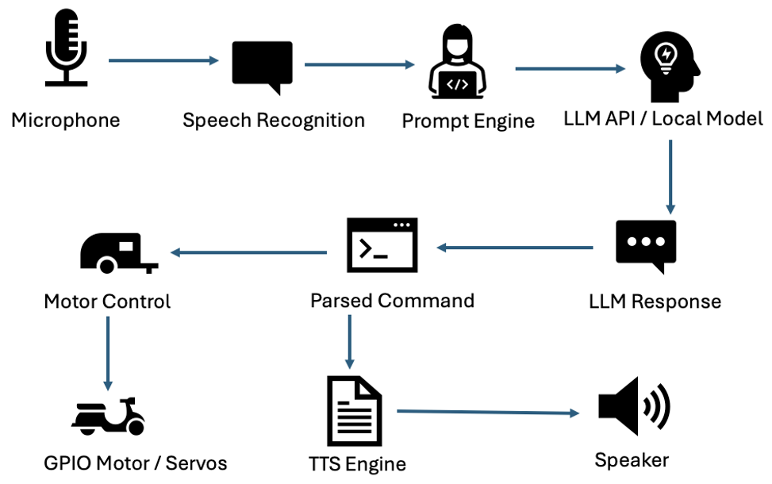

# TECHNICAL APPROACH: NLP - NATURAL LANGUAGE PROCESSING AND CONVERSATIONAL INTERFACE

## TECHNICAL APPROACH

To bring the Knight Rider-inspired KITT vehicle to life with natural language capabilities, we combined embedded robotics, cloud AI services, and local computation. The conversational interface allows users to interact with the robotic car hands-free, issuing voice commands to trigger physical actions, get answers, or experience interactive entertainment. This section details the system architecture, data flow, key algorithms, hardware-software integration, and deployment environment.

## OVERALL ARCHITECTURE

To develop a conversational interface for our robotic car system—modeled after the iconic KITT from Knight Rider—we implemented a modular yet tightly integrated architecture composed of five major subsystems. These components collectively transform human voice input into intelligent, lifelike verbal and physical responses from the car, blending speech understanding, AI reasoning, and hardware control into a cohesive experience.

### 1. Audio Input and Speech Recognition

At the front end of the system, audio input is captured through a USB microphone connected to the Raspberry Pi 4. This audio data is processed using the Python SpeechRecognition library, which is supported by underlying tools such as sox (for audio format conversion and processing) and PyAudio (for streaming audio to and from the microphone). The captured audio is then transcribed into text using a lightweight local engine. This transcription step transforms raw voice into actionable language, enabling seamless hands-free interaction.

### 2. Natural Language Processing and Conversational Logic

Once speech is converted to text, the transcribed command is sent to a conversational engine for interpretation. Here, we adopted a dual-path architecture for language understanding: (a) local deployment of open-source large language models (LLMs) such as LLaMA, hosted on a LAN-connected machine, and (b) integration with cloud-based services like OpenAI’s GPT-4O via RESTful APIs. Depending on available compute resources and desired response quality, the system can toggle between these two options. Prompt engineering plays a crucial role in this stage—we dynamically format inputs to guide the LLMs in responding with the wit, helpfulness, and personality traits reminiscent of KITT. This allows the system to support various interactions, such as answering questions, telling stories, or planning routes.

### 3. Command Parsing and Action Triggering

The natural language output from the LLM is then parsed for embedded action commands. These are predefined keywords or phrases mapped to specific behaviors of the robotic car. For instance, a phrase like “turn your head and look surprised” would trigger servo-based gimbal motions and light patterns to simulate expressive body language. This parsing mechanism is rule-based and implemented via Python scripts that translate semantic actions into GPIO or I2C instructions, driving servos, motors, and LED indicators connected through the PiCar-X's motor HAT and robot HAT extension boards. This step bridges the cognitive capabilities of the AI with the physical expressiveness of the robot.

### 4. Central Orchestration via Raspberry Pi

The Raspberry Pi 4 serves as the central control hub for the entire system. It orchestrates the full pipeline—from capturing microphone input to sending API calls, interpreting responses, and executing motor commands. The Raspberry Pi is configured to handle concurrent threads for audio processing, LLM communication, and motor control, ensuring real-time responsiveness. Moreover, the Pi utilizes an I2S amplifier and a TTS engine to vocalize responses, creating the capabilities of a talking car.

### 5. Multimodal Response Output

The final stage of the system involves delivering both spoken and physical responses to the user. The text generated by the LLM is converted back into audio using a TTS engine and played through the PiCar-X’s onboard speaker system. Simultaneously, the car performs expressive gestures, such as blinking lights, turning its head, or “rubbing its hands” via synchronized servo sequences. This multimodal output significantly enhances user engagement, giving the impression of a sentient machine that can both converse and emote. The dual feedback loop (verbal + motorized) is key to simulating an intelligent agent with personality and presence.

## DATA FLOW THROUGH THE SYSTEM

The data flow in the KITT-inspired robotic car system follows a clear, modular pipeline, with each stage contributing to a seamless and intelligent conversational interface. Although the architecture is sequential by nature—from voice input to physical response—each component is designed to function independently, allowing for future scalability, optimization, and debugging.

### 1. Input Stage: Capturing and Transcribing Speech

The interaction begins when the user speaks a command or query into the microphone mounted on the car. This analog voice signal is captured by the USB microphone and processed in real time by the Raspberry Pi 4 using the SpeechRecognition library. Audio preprocessing is handled by tools like sox and PyAudio, which ensure clean signal capture and proper formatting. Once the audio is ready, it is passed to a speech-to-text (STT) engine. The STT engine uses a Speech Recognition offline model. The output of this stage is a text representation of the user’s spoken intent.

### 2. Processing Stage: Understanding and Planning the Response

Once the text has been transcribed, it enters the core processing pipeline. Here, the text is embedded into a prompt template—a custom message designed to guide the behavior of the language model and maintain the car’s KITT-like persona. This prompt, along with the user’s input, is then sent either to a remote API (e.g., OpenAI’s GPT-4O) or a LAN-hosted instance of an open-source large language model like LLaMA. The model returns a response containing natural language, embedded commands (e.g., “turn right,” “look happy”), and emotional or contextual cues. This stage handles both linguistic understanding and basic reasoning, serving as the car’s "brain" for dialogue and decision-making.

### 3. Execution Stage: Turning Responses into Actions

The response from the language model is then parsed and split into two distinct components: spoken output and actionable commands. The speech portion is fed into a text-to-speech (TTS) engine, which generates real-time audio and broadcasts it through the car’s I2S-connected amplifier and speaker. In parallel, any commands detected in the response—such as motion directives or emotional gestures—are interpreted by a rule-based parser. These commands are translated into low-level motor instructions or GPIO/I2C signals, activating specific hardware components like LEDs or servo motors. For instance, if the LLM says “let me rub my hands while I think,” the servo motors are synchronized to perform that action in concert with the spoken line.

### 4. Feedback Loop: Learning and Error Handling

Finally, the system includes a lightweight feedback mechanism to improve robustness and user experience. All user inputs and corresponding system responses are logged for later analysis and tuning. If a command is not recognized or cannot be executed—due to ambiguous phrasing or hardware constraints—the system gracefully falls back to default prompts, asking the user for clarification or suggesting alternative phrasings. This error-handling loop not only makes the interface more resilient but also enhances the user’s perception of intelligence and adaptability in the car.

## ALGORITHMS AND HEURISTICS

Rather than building and training new machine learning models from scratch, this system leverages the powerful capabilities of existing, pre-trained large language models (LLMs) to handle the bulk of the “intelligence” and conversational reasoning. The design philosophy centers around offloading complex NLP tasks—such as understanding, reasoning, and response generation—to models like GPT-4O or LLaMA, while keeping the control logic, environment adaptation, and real-time execution tightly integrated within lightweight, deterministic systems running on the Raspberry Pi.

### Prompt Engineering for Contextual Fidelity

To maximize the effectiveness and personality consistency of the LLM’s responses, a structured prompt engineering strategy was developed. The prompts are not static but dynamically constructed based on the user’s current query, past context, and specific intent detection. These prompts also include system-level instructions that enforce a personality aligned with the Knight Rider KITT persona—helpful, witty, intelligent, and action-oriented. For example, prompts can contain tags like [mode=serious], [persona=kitt], or [task=gesture] to help the LLM generate contextually and emotionally aligned outputs.

### Regex-Based Action Parser

Once a response is generated by the LLM, it must be interpreted for potential physical actions. This is where a lightweight, regex-driven parsing system comes into play. Rather than relying on complex intent classification models or entity recognition pipelines, we utilize pattern-matching heuristics to detect key verbs and command structures within the LLM’s output. For instance, phrases like “turn left,” “look surprised,” or “say something funny” are matched using regular expressions and then mapped to specific Python callback functions that control hardware elements such as servo motors, LEDs, or text-to-speech playback. This rule-based approach is computationally efficient and highly maintainable, especially within the resource-constrained environment of an embedded system.

### Confidence and Fallback Mechanisms

To maintain reliability in real-time operation, the system implements a confidence-based fallback mechanism. This heuristic evaluates multiple conditions—such as API latency, failed responses, or speech recognition errors—and can reroute traffic between cloud-based LLMs and local models. For example, if the cloud API times out or is unavailable, the system automatically defaults to a locally hosted language model with a reduced context window. Although local models offer lower fluency, they ensure continued operation even without internet connectivity. This fallback logic is encapsulated in a monitoring wrapper that tracks error rates, response times, and system status to guide decision-making on the fly.

## HARDWARE AND CIRCUIT INTEGRATION

The physical embodiment of the conversational interface is built on a tightly integrated stack of modular components, each selected to balance functionality, responsiveness, and compatibility with real-time embedded systems. At the heart of the system is a Raspberry Pi 4, which serves as the central processing and orchestration hub. It handles everything from audio input and API communications to motor control and output synthesis, all while running a lightweight Linux OS that supports Python-based interfacing.

The Pi is equipped with an I2S audio amplifier, which drives the audio output from the text-to-speech engine. This low-latency digital audio interface ensures clear voice playback, free of analog noise artifacts that can arise with traditional 3.5mm jack solutions. For capturing user commands, a USB microphone is connected directly to the Pi and sampled using PyAudio, providing reliable voice input even in noisy or mobile environments.

Mounted with the Pi is the SunFounder PiCar-X Kit, a robotics platform that includes two DC motors for differential drive, a multi-channel Robot HAT for servo and motor control, and onboard power regulation. The HAT acts as the primary interface for actuating the motors and servos, driven through GPIO pins controlled by the Pi’s software stack. Servos are used for expressive gestures—such as head tilts or hand waves—triggered by parsed actions in the LLM's response.

To support more advanced language understanding and longer conversational memory, the system offloads intensive inference tasks to an external machine on the same LAN. This machine, typically a workstation or server equipped with a GPU, runs open-source LLMs like LLaMA. A custom Flask-based REST API facilitates communication between the Raspberry Pi and this external host, providing a flexible yet high-performance pipeline for language processing without relying on cloud services.

All components are wired with an emphasis on modularity and expandability. Power rails are isolated to prevent motor-induced noise from affecting digital logic, and all I2C and GPIO lines are documented for ease of debugging and future development. Together, this hardware architecture enables a seamless blend of voice-based interaction, expressive physical feedback, and intelligent dialogue—all within a compact mobile robot form.

## CIRCUIT AND SYSTEM DIAGRAM

A high-level circuit and system diagram: Each component is modular, allowing upgrades to the LLM, speech engine, or physical capabilities independently.

