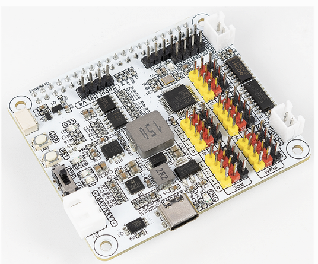

# TECHNICAL APPROACH: RL - USING REINFORCEMENT LEARNING TO BUILD THE SELF-DRIVING SYSTEM

## OVERALL ARCHITECTURE

The core architecture of the reinforcement learning (RL) feature is centered around a self-driving robotic vehicle equipped with environmental sensing and decision-making capabilities. The vehicle is constructed on a two-wheel rear-drive chassis, powered by two motors, enabling basic movement operations: forward, backward, left, and right. An ultrasonic sensor mounted at the front of the vehicle provides real-time distance measurements to detect nearby obstacles, while a forward-facing camera supplies visual input for computer vision enhancements. These sensing modules form the vehicle’s perception layer, enabling it to interpret its surroundings and navigate accordingly.

## DATA FLOW THROUGH THE SYSTEM

The data flow begins with the sensing modules: the ultrasonic sensor continuously measures distances to identify imminent collision threats, while the camera captures visual frames that may be processed for scene understanding or object detection. This sensor data is relayed to the control module, where decision-making algorithms process the inputs and select appropriate actions. Based on the processed inputs, motor control commands are generated and sent to the chassis to adjust the vehicle’s movement in real time. The environment then responds to these actions, closing the feedback loop and enabling the agent to learn from its interactions.

## ALGORITHMS AND REINFORCEMENT LEARNING APPROACH

To implement autonomous decision-making, we developed a reinforcement learning-based self-driving model. Specifically, we experimented with both traditional Q-learning and Deep Q-Networks (DQN). These algorithms enable the vehicle to learn optimal driving policies through trial and error. The learning agent is defined by a set of discrete states (e.g., distance to obstacles, current direction), a set of possible actions (e.g., move forward, turn left), and a reward structure that encourages safe navigation and penalizes collisions or ineffective maneuvers.

In the Q-learning approach, a Q-table is maintained to estimate the expected utility of taking specific actions in each state. As the vehicle interacts with its environment, it updates this table using the Bellman equation to improve its policy over time. For more complex scenarios, we utilized DQNs, which approximate the Q-function using a neural network. This allows the model to handle a larger state space with more complex sensor inputs, particularly when incorporating camera data for vision-based navigation.

For safety and stability during the early stages of learning, we deliberately lower the vehicle's movement speed and restrict training to a controlled environment. In these early stages, the agent has not yet learned how to respond properly to obstacles, so slower speeds minimize damage and allow for safer experimentation. As the car becomes more competent and reliable, it can be tested in more complex, dynamic environments.

To ensure that learning is not lost between sessions, we implement persistent storage of the RL model. Specifically, the RL values (which encode the agent’s experience and knowledge) are periodically saved to disk. When the program starts, it checks for existing saved models and loads them if available, allowing the car to resume learning from where it left off, rather than starting from scratch each time. This long-term memory is essential for cumulative improvement over days of training.

The system is designed to learn online, which means it continuously improves its decision-making capabilities as it interacts with the environment in real time. Each experience—whether successful navigation or a collision with an obstacle—feeds back into the reinforcement learning model, allowing the car to refine its behavior. By running this over days of training, the agent can build a more robust understanding of which actions lead to safe, efficient navigation and which do not.

## HARDWARE AND SOFTWARE INTEGRATION

The project integrates both hardware and software components seamlessly. The hardware includes the chassis, motors, motor driver, ultrasonic sensor, and camera—all interfaced through a Raspberry Pi. The software stack comprises control logic for motor actuation, sensor data acquisition modules, and reinforcement learning agents running in Python. The RL algorithms are trained online (in real time), then reused to guide the car’s decision-making process in real environments. For future improvements, computer vision (CV) and natural language processing (NLP) modules can be added to enhance perception and introduce voice-command controls, respectively.

## CIRCUIT DIAGRAM AND SYSTEM OVERVIEW

The circuit consists of a power supply feeding both the Raspberry Pi and motor driver. The ultrasonic sensor is connected to GPIO pins for triggering and echo signal reading. The motor driver receives directional and PWM control signals from the Pi to manage the rear motors. The camera connects via the Pi’s CSI interface. All software modules communicate via a central control loop, enabling real-time response to environmental changes and updating the vehicle’s behavior through learned policies. Example of circuit with GPIO pins showing below.

